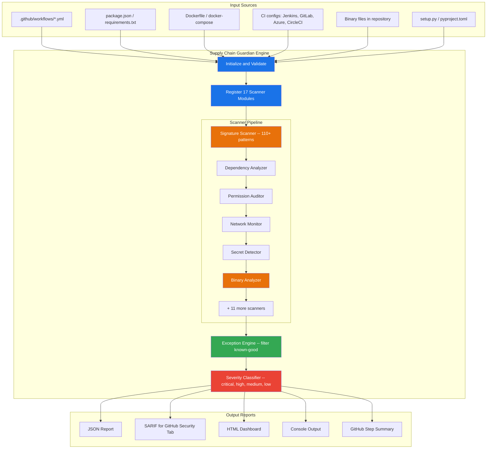
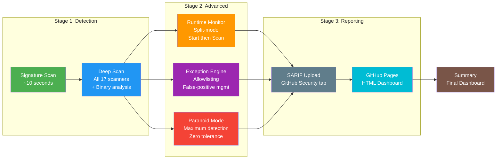

<div align="center">

# Supply Chain Guardian -- Interactive Showcase

### 37 Real-World Attack Scenarios | 17 Scanner Modules | 8-Stage CI Pipeline | 110+ Detection Patterns

[](https://github.com/anshumaan-10/supply-chain-guardian)
[](#attack-scenarios)
[](#scanner-coverage)
[](#showcase-pipeline)
[](LICENSE)

**[View Live Report](http://www.devsecopswithanshu.com/supply-chain-guardian-demo/)** | **[GitHub Marketplace](https://github.com/marketplace/actions/supply-chain-guardian)** | **[Source Code](https://github.com/anshumaan-10/supply-chain-guardian)**

---

*This repository is an interactive demonstration of Supply Chain Guardian, the most comprehensive GitHub Actions security scanner. It detects supply chain attacks that other tools miss.*

</div>

---

## What This Repository Demonstrates

This showcase contains **intentionally vulnerable** workflow files, package manifests, Dockerfiles, and CI configurations representing **37 distinct real-world attack vectors** across 39 files. The Supply Chain Guardian CI pipeline scans these files and produces detailed detection reports, showing exactly how SCG protects your software supply chain.

> **WARNING: These files are intentionally vulnerable for demonstration purposes. Do not copy them into production projects.**

### Why This Matters

Supply chain attacks have surged **742%** since 2019 (Sonatype). Notable incidents include:

| Incident | Impact | SCG Detection |
|----------|--------|---------------|
| **SolarWinds SUNBURST** | 18,000+ organizations | Build system compromise patterns (SCA-017) |
| **Codecov Bash Uploader** | Thousands of CI secrets | Network exfiltration + script injection |
| **tj-actions/changed-files** | GitHub Actions supply chain | Compromised action SHA detection (SCA-001) |
| **xz-utils backdoor** | Linux infrastructure | Behavioral obfuscation + build inject (SCA-016) |
| **event-stream** | 8M downloads/week | Compromised dependency detection (SCA-013) |
| **ua-parser-js** | Cryptominer injection | Malicious package + binary patterns (SCA-014) |
| **node-ipc protestware** | Geopolitical wiper | Known malicious package database (SCA-032) |
| **Polyfill.io CDN** | 100K+ websites | CDN compromise detection (SCA-046) |
| **TeamPCP/MUT-1244** | CI runner credential theft | Runner.Worker process targeting (SCA-091+) |
| **3CX Desktop App** | Signed binary compromise | DLL sideloading patterns (SCA-018) |

---

## Architecture

### How Supply Chain Guardian Works



### Showcase Pipeline Flow



---

## Attack Scenarios

### Core Workflow Attacks (Scenarios 01-18)

| # | Scenario | File | Severity | Patterns Triggered |
|---|----------|------|----------|-------------------|
| 01 | Compromised Action | [01-compromised-action.yml](vulnerable-workflows/01-compromised-action.yml) | Critical | SCA-001, SCA-002, SCA-003 |
| 02 | PWN Request | [02-pwn-request.yml](vulnerable-workflows/02-pwn-request.yml) | Critical | SCA-004, SCA-026, SCA-045 |
| 03 | Secret Exposure | [03-secret-exposure.yml](vulnerable-workflows/03-secret-exposure.yml) | Critical | SCA-030, SCA-044, SCA-060 |
| 04 | Network Exfiltration | [04-network-exfiltration.yml](vulnerable-workflows/04-network-exfiltration.yml) | Critical | SCA-038, SCA-039, SCA-040 |
| 05 | Cache Poisoning | [05-cache-poisoning.yml](vulnerable-workflows/05-cache-poisoning.yml) | High | SCA-010, SCA-011 |
| 06 | Permission Escalation | [06-permission-escalation.yml](vulnerable-workflows/06-permission-escalation.yml) | High | SCA-005, SCA-006 |
| 07 | Malicious npm Packages | [07-package.json](vulnerable-workflows/07-package.json) | Critical | SCA-013, SCA-014, SCA-032 |
| 08 | Python Typosquatting | [08-requirements.txt](vulnerable-workflows/08-requirements.txt) | Critical | SCA-019, SCA-020, SCA-047 |
| 09 | Container Escape | [09-container-escape.yml](vulnerable-workflows/09-container-escape.yml) | High | SCA-073, SCA-074, SCA-076 |
| 10 | OIDC Abuse | [10-oidc-abuse.yml](vulnerable-workflows/10-oidc-abuse.yml) | High | SCA-061, SCA-062, SCA-063 |
| 11 | Artifact Poisoning | [11-artifact-poisoning.yml](vulnerable-workflows/11-artifact-poisoning.yml) | High | SCA-036, SCA-049, SCA-067 |
| 12 | Reusable Workflow Trust | [12-reusable-workflow-trust.yml](vulnerable-workflows/12-reusable-workflow-trust.yml) | High | SCA-084, SCA-085 |
| 13 | Binary Dropper | [13-binary-dropper.yml](vulnerable-workflows/13-binary-dropper.yml) | Critical | SCA-037, SCA-041, SCA-042 |
| 14 | Runtime Cryptominer | [14-runtime-cryptominer.yml](vulnerable-workflows/14-runtime-cryptominer.yml) | Critical | SCA-102, SCA-103, SCA-104 |
| 15 | Behavioral Obfuscation | [15-behavioral-obfuscation.yml](vulnerable-workflows/15-behavioral-obfuscation.yml) | Critical | SCA-008, SCA-009 |
| 16 | Cross-Platform CI | [16-Jenkinsfile](vulnerable-workflows/16-Jenkinsfile), [16-gitlab-ci.yml](vulnerable-workflows/16-gitlab-ci.yml) | High | SCA-105, SCA-106 |
| 17 | Egress Exfiltration | [17-egress-exfiltration.yml](vulnerable-workflows/17-egress-exfiltration.yml) | Critical | SCA-109, SCA-038, SCA-039 |
| 18 | Exception Engine Config | [18-scg-config.yml](vulnerable-workflows/18-scg-config.yml) | Medium | Exception management |

### Advanced Attack Patterns (Scenarios 19-37)

| # | Scenario | File | Severity | Patterns Triggered |
|---|----------|------|----------|-------------------|
| 19 | TeamPCP/MUT-1244 Indicators | [19-teampcp-indicators.yml](vulnerable-workflows/19-teampcp-indicators.yml) | Critical | SCA-091 to SCA-100 |
| 20 | Cloud Metadata IMDS | [20-cloud-metadata-imds.yml](vulnerable-workflows/20-cloud-metadata-imds.yml) | Critical | SCA-110 |
| 21 | AI Credential Exposure | [21-ai-credential-exposure.yml](vulnerable-workflows/21-ai-credential-exposure.yml) | Critical | SCA-060, SCA-044 |
| 22 | Polyfill CDN Attack | [22-polyfill-cdn-attack.yml](vulnerable-workflows/22-polyfill-cdn-attack.yml) | Critical | SCA-046, SCA-025 |
| 23 | Self-Hosted Runner Risks | [23-self-hosted-runner.yml](vulnerable-workflows/23-self-hosted-runner.yml) | High | SCA-035, SCA-051, SCA-033 |
| 24 | Output Injection | [24-output-injection.yml](vulnerable-workflows/24-output-injection.yml) | Critical | SCA-027, SCA-045, SCA-004, SCA-026 |
| 25 | Reusable Workflow Attacks | [25-reusable-workflow-attacks.yml](vulnerable-workflows/25-reusable-workflow-attacks.yml) | High | SCA-084 to SCA-090 |
| 26 | Container Supply Chain | [26-Dockerfile](vulnerable-workflows/26-Dockerfile), [26-container-attacks.yml](vulnerable-workflows/26-container-attacks.yml) | Critical | SCA-073 to SCA-083 |
| 27 | OIDC Token Abuse | [27-oidc-token-abuse.yml](vulnerable-workflows/27-oidc-token-abuse.yml) | Critical | SCA-061 to SCA-066 |
| 28 | Artifact Integrity Attacks | [28-artifact-attacks.yml](vulnerable-workflows/28-artifact-attacks.yml) | High | SCA-036, SCA-049, SCA-067 to SCA-072 |
| 29 | Dependency Confusion | [29-dependency-confusion.yml](vulnerable-workflows/29-dependency-confusion.yml) | Critical | SCA-019, SCA-020, SCA-043, SCA-047, SCA-057 |
| 30 | Azure DevOps Patterns | [30-azure-pipelines.yml](vulnerable-workflows/30-azure-pipelines.yml) | High | SCA-108 |
| 31 | CircleCI Config Issues | [31-circleci-config.yml](vulnerable-workflows/31-circleci-config.yml) | High | SCA-107, SCA-021 |
| 32 | Wheel Diff Attack | [32-setup.py](vulnerable-workflows/32-setup.py) | Critical | SCA-058 |
| 33 | ML Model Loading Risks | [33-ml-model-risks.yml](vulnerable-workflows/33-ml-model-risks.yml) | High | SCA-053 |
| 34 | Network Egress Anomaly | [34-network-egress-anomaly.yml](vulnerable-workflows/34-network-egress-anomaly.yml) | Critical | SCA-109, SCA-039, SCA-038 |
| 35 | Dispatch and CODEOWNERS | [35-dispatch-codeowners.yml](vulnerable-workflows/35-dispatch-codeowners.yml) | High | SCA-054, SCA-059, SCA-028 |
| 36 | Additional Malicious Packages | [36-additional-malicious-packages.yml](vulnerable-workflows/36-additional-malicious-packages.yml) | Critical | SCA-013, SCA-014, SCA-032, SCA-102 to SCA-104 |
| 37 | Build System Compromise | [37-build-system-compromise.yml](vulnerable-workflows/37-build-system-compromise.yml) | Critical | SCA-016, SCA-017, SCA-018, SCA-055, SCA-046 |

---

## Scanner Coverage

Supply Chain Guardian runs **17 specialized scanner modules**, each targeting a specific attack surface:

| # | Scanner | What It Detects | Pattern Count |
|---|---------|-----------------|---------------|
| 1 | **Signature Scanner** | Known attack patterns, malicious code signatures, compromised SHAs | 110+ |
| 2 | **Dependency Analyzer** | Compromised packages, typosquats, protestware, dependency confusion | 30+ |
| 3 | **Permission Auditor** | Overly broad permissions, write-all, missing job-level scoping | 15+ |
| 4 | **Network Monitor** | Reverse shells, C2 callbacks, DNS exfiltration, IMDS access | 20+ |
| 5 | **Secret Detector** | Hardcoded credentials, API keys, tokens, AI service keys | 25+ |
| 6 | **Workflow Analyzer** | Dangerous triggers, unsafe checkout, script injection | 20+ |
| 7 | **Cache Inspector** | Poisoning vectors, broad restore-keys, cross-branch injection | 8+ |
| 8 | **Container Scanner** | Unpinned images, privileged mode, socket mounts, insecure registries | 12+ |
| 9 | **OIDC Validator** | Token abuse, audience wildcards, scope escalation, token forwarding | 6+ |
| 10 | **Artifact Auditor** | Unsigned downloads, TOCTOU, cross-workflow trust, path traversal | 8+ |
| 11 | **Binary Analyzer** | Executable detection, entropy analysis, known malicious tools | 15+ |
| 12 | **Runtime Monitor** | Process behavior, file access, network connections during build | 10+ |
| 13 | **Egress Controller** | Unauthorized outbound connections, data exfiltration, DNS tunneling | 12+ |
| 14 | **Injection Scanner** | Script injection, expression injection, GITHUB_ENV/OUTPUT manipulation | 10+ |
| 15 | **CI Config Auditor** | Jenkins, GitLab, Azure DevOps, CircleCI security issues | 8+ |
| 16 | **Obfuscation Detector** | Base64 encoding, eval chains, staged payloads, wheel diff | 12+ |
| 17 | **Exception Engine** | Allowlist management, severity overrides, per-file exemptions | -- |

---

## Showcase Pipeline

The [CI pipeline](.github/workflows/showcase-pipeline.yml) runs **8 jobs** demonstrating different SCG capabilities:

### Pipeline Jobs

<details>
<summary><b>Step 1: Signature Detection</b> -- Fast pattern matching in ~10 seconds</summary>

```yaml
- uses: anshumaan-10/supply-chain-guardian@v4
  with:
    scan-mode: quick
    fail-on-severity: none
    verbose: true
    sarif-output: 'false'
    artifact-name: scg-quick-scan
```

- Runs only the signature scanner (110+ patterns)
- Fastest possible scan for CI/CD feedback loops
- Shows total findings count without blocking the pipeline

</details>

<details>
<summary><b>Step 2: Deep Multi-Scanner Analysis</b> -- All 17 scanners + binary analysis</summary>

```yaml
- uses: anshumaan-10/supply-chain-guardian@v4
  with:
    scan-mode: deep
    fail-on-severity: none
    scan-binaries: true
    html-output: true
    verbose: true
    json-output: deep-scan-report.json
    sarif-output: 'true'
    artifact-name: scg-deep-scan
```

- Activates all 17 scanner modules simultaneously
- Binary analysis for executables in the repository
- Generates HTML, JSON, and SARIF reports
- Uploads separate artifacts: HTML dashboard, JSON data, SARIF file

</details>

<details>
<summary><b>Step 3: Runtime Behavioral Monitoring</b> -- Split-mode: monitor, build, scan</summary>

```yaml
# Phase 1: Start background monitor
- uses: anshumaan-10/supply-chain-guardian@v4
  with:
    mode: monitor-start
    monitor-duration: '15'
    skip-artifact-upload: 'true'

# Phase 2: Simulated build activity (monitored)
- run: |
    echo "Installing dependencies..."
    echo "Building application..."
    sleep 5

# Phase 3: Scan with runtime findings
- uses: anshumaan-10/supply-chain-guardian@v4
  with:
    scan-mode: deep
    scan-runtime: 'true'
    artifact-name: scg-runtime-scan
```

- Demonstrates real-time build monitoring
- Captures process spawns, network connections, file access during build
- Correlates runtime behavior with static findings

</details>

<details>
<summary><b>Step 4: Exception Engine and Allowlisting</b> -- False-positive management</summary>

```yaml
- uses: anshumaan-10/supply-chain-guardian@v4
  with:
    scan-mode: deep
    exception-config: .scg-config.yml
    artifact-name: scg-exception-scan
```

- Shows how to manage known-good patterns
- Egress allowlisting for npm, GitHub API, PyPI
- Severity overrides for specific findings
- Per-file and per-pattern exemptions

</details>

<details>
<summary><b>Step 5: Paranoid Zero-Trust Audit</b> -- Maximum detection, zero tolerance</summary>

```yaml
- uses: anshumaan-10/supply-chain-guardian@v4
  with:
    scan-mode: paranoid
    fail-on-severity: none
    scan-binaries: true
    verbose: true
    sarif-output: 'true'
    artifact-name: scg-paranoid-audit
```

- Every scanner at maximum sensitivity
- Scans /tmp and build directories
- Ideal for high-security environments
- Generates both HTML and SARIF output

</details>

<details>
<summary><b>Step 6: Security Tab Integration</b> -- SARIF upload to GitHub Code Scanning</summary>

```yaml
- uses: github/codeql-action/upload-sarif@8ff85221d12737ec1137e6a892722e5130f32d05
  with:
    sarif_file: sarif-report-deep/
    category: supply-chain-guardian
```

- Downloads SARIF artifact from deep scan
- Uploads to GitHub Code Scanning
- Findings appear in the repository Security tab
- Enables PR annotations for new findings

</details>

<details>
<summary><b>Step 7: Deploy Reports to GitHub Pages</b> -- Live HTML report deployment</summary>

- Downloads all HTML report artifacts
- Runs site generation script for a professional dark-themed dashboard
- Deploys to GitHub Pages automatically
- **[View Live Report](http://www.devsecopswithanshu.com/supply-chain-guardian-demo/)**

</details>

<details>
<summary><b>Step 8: Pipeline Summary</b> -- Final results aggregation</summary>

- Downloads all scan artifacts
- Aggregates findings from all scan modes
- Displays final summary in GitHub Actions step summary
- Links to all artifacts and deployed reports

</details>

---

## Integration Examples

SCG works across multiple CI/CD platforms:

| Platform | Example | Status |
|----------|---------|--------|
| **GitHub Actions** | [showcase-pipeline.yml](.github/workflows/showcase-pipeline.yml) | Native support |
| **GitLab CI** | [.gitlab-ci.yml](integrations/.gitlab-ci.yml) | SARIF to Security Dashboard |
| **Jenkins** | [Jenkinsfile](integrations/Jenkinsfile) | warnings-ng integration |
| **Local CLI** | [local-cli-scan.sh](integrations/local-cli-scan.sh) | Dev machine scanning |
| **Azure DevOps** | [Inline example](integrations/README.md#azure-devops) | Pipeline artifact |
| **CircleCI** | [Inline example](integrations/README.md#circleci) | Store artifacts |

See the [Integration Guide](integrations/README.md) for complete setup instructions.

---

## Input Reference

| Input | Description | Default | Values |
|-------|-------------|---------|--------|
| `scan-mode` | Scanner depth | `deep` | `quick`, `deep`, `paranoid`, `monitor-start` |
| `fail-on-severity` | Block threshold | `high` | `none`, `low`, `medium`, `high`, `critical` |
| `verbose` | Detailed output | `false` | `true`, `false` |
| `scan-binaries` | Analyze executables | `false` | `true`, `false` |
| `html-output` | HTML report | `false` | `true`, `false` |
| `html-output-path` | HTML file path | `scg-report.html` | any path |
| `json-output` | JSON report path | -- | any path |
| `sarif-output` | SARIF generation | `false` | `true`, `false` |
| `exception-config` | Config file path | -- | path to `.scg-config.yml` |
| `egress-allowlist` | Allowed domains | -- | comma-separated domains |
| `monitor-duration` | Runtime monitor time | `30` | seconds |
| `artifact-name` | Upload artifact name | `supply-chain-guardian-report` | any string |
| `skip-artifact-upload` | Skip artifact upload | `false` | `true`, `false` |
| `scan-runtime` | Include runtime data | `false` | `true`, `false` |

## Output Reference

| Output | Description | Example |
|--------|-------------|---------|
| `status` | Overall result | `success` or `failure` |
| `total-findings` | Total findings count | `87` |
| `critical-findings` | Critical severity count | `24` |
| `high-findings` | High severity count | `31` |
| `medium-findings` | Medium severity count | `19` |
| `low-findings` | Low severity count | `13` |
| `scan-duration` | Execution time | `3.2s` |
| `report-path` | JSON report location | `deep-scan-report.json` |
| `html-report-path` | HTML report location | `scg-report.html` |

---

## Quick Start

### Use in Your Repository

```yaml
# .github/workflows/security.yml
name: Supply Chain Security
on: [push, pull_request]

jobs:
  scan:
    runs-on: ubuntu-latest
    permissions:
      contents: read
      security-events: write
    steps:
      - uses: actions/checkout@v4

      - uses: anshumaan-10/supply-chain-guardian@v4
        id: scg
        with:
          scan-mode: deep
          fail-on-severity: high
          verbose: true
          sarif-output: true
          html-output: true

      - uses: github/codeql-action/upload-sarif@v3
        if: always()
        with:
          sarif_file: supply-chain-guardian.sarif

      - uses: actions/upload-artifact@v4
        if: always()
        with:
          name: security-report
          path: scg-report.html
```

### Run Locally

```bash
# Clone and scan any project
git clone https://github.com/anshumaan-10/supply-chain-guardian.git /tmp/scg
pip install pyyaml requests tabulate colorama jsonschema semver

INPUT_SCAN_MODE=deep \
INPUT_FAIL_ON_SEVERITY=high \
INPUT_VERBOSE=true \
python /tmp/scg/src/main.py --workspace /path/to/your/project
```

---

## Repository Structure

```
supply-chain-guardian-demo/
|-- .github/
|   +-- workflows/
|       +-- showcase-pipeline.yml        # 8-job CI pipeline (SHA-pinned)
|-- vulnerable-workflows/
|   |-- 01-compromised-action.yml        # Compromised GitHub Action
|   |-- 02-pwn-request.yml               # pull_request_target attack
|   |-- 03-secret-exposure.yml           # Hardcoded secrets
|   |-- 04-network-exfiltration.yml      # Reverse shells and C2
|   |-- 05-cache-poisoning.yml           # Cache injection
|   |-- 06-permission-escalation.yml     # Over-privileged workflows
|   |-- 07-package.json                  # Malicious npm packages (30+)
|   |-- 08-requirements.txt             # Python typosquats and confusion
|   |-- 09-container-escape.yml          # Docker security issues
|   |-- 10-oidc-abuse.yml               # Token abuse
|   |-- 11-artifact-poisoning.yml        # Artifact trust issues
|   |-- 12-reusable-workflow-trust.yml   # Workflow trust boundaries
|   |-- 13-binary-dropper.yml            # Malware download
|   |-- 14-runtime-cryptominer.yml       # Cryptomining
|   |-- 15-behavioral-obfuscation.yml    # Obfuscated payloads
|   |-- 16-Jenkinsfile                   # Jenkins attacks
|   |-- 16-gitlab-ci.yml                # GitLab attacks
|   |-- 17-egress-exfiltration.yml       # Data exfiltration
|   |-- 18-scg-config.yml               # Exception config demo
|   |-- 19-teampcp-indicators.yml        # TeamPCP/MUT-1244
|   |-- 20-cloud-metadata-imds.yml       # Cloud IMDS access
|   |-- 21-ai-credential-exposure.yml    # AI/LLM API keys
|   |-- 22-polyfill-cdn-attack.yml       # CDN compromise
|   |-- 23-self-hosted-runner.yml        # Self-hosted runner risks
|   |-- 24-output-injection.yml          # GITHUB_ENV/OUTPUT injection
|   |-- 25-reusable-workflow-attacks.yml  # Reusable workflow abuse
|   |-- 26-Dockerfile                    # Container vulnerabilities
|   |-- 26-container-attacks.yml         # Container build pipeline
|   |-- 27-oidc-token-abuse.yml          # OIDC token forwarding
|   |-- 28-artifact-attacks.yml          # Artifact integrity bypass
|   |-- 29-dependency-confusion.yml      # Package confusion attacks
|   |-- 30-azure-pipelines.yml           # Azure DevOps patterns
|   |-- 31-circleci-config.yml           # CircleCI patterns
|   |-- 32-setup.py                      # Wheel diff attack
|   |-- 33-ml-model-risks.yml            # ML model loading risks
|   |-- 34-network-egress-anomaly.yml    # Egress anomaly detection
|   |-- 35-dispatch-codeowners.yml       # Dispatch and CODEOWNERS
|   |-- 36-additional-malicious-packages.yml  # Cryptominers, worms
|   +-- 37-build-system-compromise.yml   # XZ Utils, SolarWinds, 3CX
|-- scripts/
|   +-- generate-site.py                 # GitHub Pages generator
|-- integrations/
|   |-- .gitlab-ci.yml                   # GitLab CI template
|   |-- Jenkinsfile                      # Jenkins pipeline
|   |-- local-cli-scan.sh               # Local CLI scanner
|   +-- README.md                        # Integration guide
|-- .scg-config.yml                      # Root exception config
|-- LICENSE                              # BSL 1.1
+-- README.md                            # This file
```

---

## Detection Statistics

Based on scanning this demonstration repository:

| Metric | Value |
|--------|-------|
| **Total attack patterns in database** | 110 (50 critical, 46 high, 13 medium, 1 low) |
| **Unique attack vectors demonstrated** | 37 |
| **Vulnerable files** | 39 |
| **Scanner modules activated** | 17 |
| **CI pipeline jobs** | 8 |
| **Report formats** | 4 (Console, JSON, HTML, SARIF) |
| **Integration platforms** | 6 (GitHub, GitLab, Jenkins, Azure, CircleCI, CLI) |
| **Actions SHA-pinned** | All (checkout, upload-artifact, download-artifact, codeql-action, gh-pages, setup-python) |

---

## Security Notice

This repository contains **intentionally vulnerable code** for security testing and demonstration purposes only. The vulnerable files:

- Are not executable in this repository
- Do not contain real credentials or secrets
- Are designed to trigger Supply Chain Guardian detection rules
- Should **never** be copied into production projects

All credentials shown are clearly marked placeholders (e.g., `AKIA_EXAMPLE_NOT_REAL_KEY`).

---

## Author

**Anshumaan Singh**

- GitHub: [@anshumaan-10](https://github.com/anshumaan-10)
- Tool: [Supply Chain Guardian](https://github.com/anshumaan-10/supply-chain-guardian)
- Marketplace: [GitHub Marketplace](https://github.com/marketplace/actions/supply-chain-guardian)

---

## License

This project is licensed under the **Business Source License 1.1** -- see the [LICENSE](LICENSE) file for details.

- **Licensor**: Anshumaan Singh
- **Licensed Work**: Supply Chain Guardian Demo
- **Change Date**: 2026-12-31
- **Change License**: Apache License 2.0

### Attribution Requirement

Any use, reproduction, or distribution of this work must retain the original author attribution to **Anshumaan Singh**. Removal of copyright notices or author attribution is prohibited.

---

<div align="center">

**Built by [Anshumaan Singh](https://github.com/anshumaan-10)**

*Protecting the software supply chain, one scan at a time.*

[](https://github.com/anshumaan-10/supply-chain-guardian-demo)

</div>

## Overview

This repository contains project code and supporting assets. It is maintained actively with periodic updates.

## Getting Started

1. Clone this repository.
2. Install dependencies as documented in the project files.
3. Run/build using the project-specific commands.

## Contribution Guidelines

Please open an issue for major changes and submit focused pull requests with clear descriptions.
