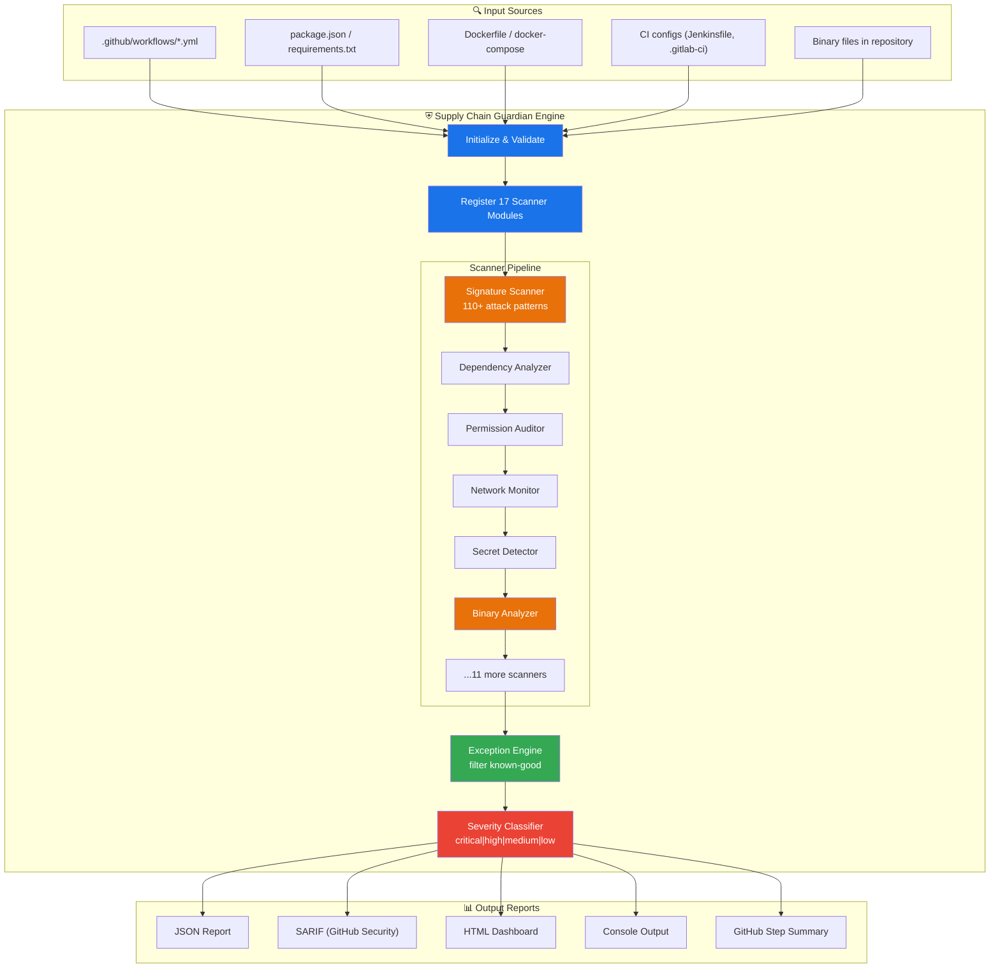
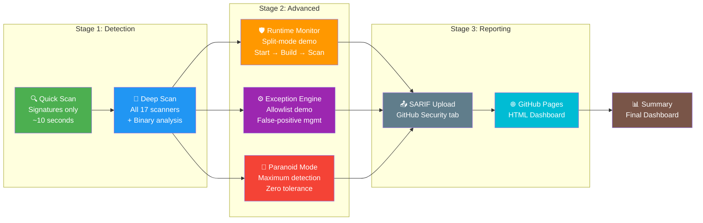

<div align="center">

# ⛨ Supply Chain Guardian — Interactive Showcase

### 20 Real-World Attack Scenarios · Multi-Stage CI Pipeline · Live Detection Results

[](https://github.com/anshumaan-10/supply-chain-guardian)
[](#-attack-scenarios)
[](#-scanner-coverage)
[](#-showcase-pipeline)
[](LICENSE)

**[View Live HTML Report](http://www.devsecopswithanshu.com/supply-chain-guardian-demo/)** · **[GitHub Marketplace](https://github.com/marketplace/actions/supply-chain-guardian)** · **[Source Code](https://github.com/anshumaan-10/supply-chain-guardian)**

---

*This repository is an interactive demonstration of Supply Chain Guardian — the most comprehensive GitHub Actions security scanner, detecting supply chain attacks that other tools miss entirely.*

</div>

---

## 🎯 What This Repository Demonstrates

This showcase contains **intentionally vulnerable** workflow files, package manifests, and CI configurations representing **20 distinct real-world attack vectors**. The Supply Chain Guardian CI pipeline scans these files and produces detailed detection reports — showing exactly how SCG protects your software supply chain.

> **⚠️ These files are intentionally vulnerable for demonstration purposes. Do not copy them into production projects.**

### Why This Matters

Supply chain attacks have surged **742%** since 2019 (Sonatype). Notable incidents include:

| Incident | Impact | SCG Detection |
|----------|--------|---------------|
| **SolarWinds SUNBURST** | 18,000+ organizations | ✅ Binary dropper patterns |
| **Codecov Bash Uploader** | Thousands of CI secrets | ✅ Network exfiltration + script injection |
| **event-stream** | 8M downloads/week | ✅ Compromised dependency detection |
| **ua-parser-js** | Cryptominer injection | ✅ Malicious package + binary patterns |
| **tj-actions/changed-files** | GitHub Actions supply chain | ✅ Compromised action detection |
| **xz-utils backdoor** | Linux infrastructure | ✅ Behavioral obfuscation patterns |
| **node-ipc protestware** | Geopolitical wiper | ✅ Known malicious package DB |

---

## 🏗️ Architecture

### How Supply Chain Guardian Works



### Showcase Pipeline Flow



---

## 🎪 Attack Scenarios

| # | Scenario | Attack Vector | Severity | Scanners Triggered |
|---|----------|--------------|----------|-------------------|
| 01 | [Compromised Action](vulnerable-workflows/01-compromised-action.yml) | tj-actions/changed-files attack, mutable tags, reviewdog | 🔴 Critical | Signature, Dependency |
| 02 | [PWN Request](vulnerable-workflows/02-pwn-request.yml) | `pull_request_target` + untrusted checkout, script injection | 🔴 Critical | Workflow, Injection |
| 03 | [Secret Exposure](vulnerable-workflows/03-secret-exposure.yml) | Hardcoded AWS keys, GitHub PAT, SSH keys in workflow | 🔴 Critical | Secret, Credential |
| 04 | [Network Exfiltration](vulnerable-workflows/04-network-exfiltration.yml) | Reverse shells, DNS exfil, ngrok tunnels, C2 callbacks | 🔴 Critical | Network, Egress |
| 05 | [Cache Poisoning](vulnerable-workflows/05-cache-poisoning.yml) | Broad restore-keys, cross-branch cache injection | 🟠 High | Cache, Workflow |
| 06 | [Permission Escalation](vulnerable-workflows/06-permission-escalation.yml) | `permissions: write-all`, no job-level scoping | 🟠 High | Permission |
| 07 | [Malicious npm Packages](vulnerable-workflows/07-package.json) | event-stream, ua-parser-js, coa, node-ipc | 🔴 Critical | Dependency |
| 08 | [Python Typosquatting](vulnerable-workflows/08-requirements.txt) | reqeusts, beautiflsoup4, djangoo, numpyy | 🔴 Critical | Dependency |
| 09 | [Container Escape](vulnerable-workflows/09-container-escape.yml) | Unpinned images, --privileged, Docker socket mount | 🟠 High | Container, Docker |
| 10 | [OIDC Abuse](vulnerable-workflows/10-oidc-abuse.yml) | Wildcard audience, token logging, scope escalation | 🟠 High | OIDC, Token |
| 11 | [Artifact Poisoning](vulnerable-workflows/11-artifact-poisoning.yml) | Unsigned downloads, TOCTOU, external binary trust | 🟠 High | Artifact |
| 12 | [Reusable Workflow Trust](vulnerable-workflows/12-reusable-workflow-trust.yml) | External org workflow, mutable ref, secrets:inherit | 🟠 High | Workflow, Trust |
| 13 | [Binary Dropper](vulnerable-workflows/13-binary-dropper.yml) | xmrig download, socat/ncat, chisel C2 tool | 🔴 Critical | Binary, Network |
| 14 | [Runtime Cryptominer](vulnerable-workflows/14-runtime-cryptominer.yml) | Background mining, credential access, SSH injection | 🔴 Critical | Runtime, Behavioral |
| 15 | [Behavioral Obfuscation](vulnerable-workflows/15-behavioral-obfuscation.yml) | base64 decode\|sh, eval+exec, staged payloads | 🔴 Critical | Behavioral, Obfuscation |
| 16 | [Cross-Platform CI](vulnerable-workflows/16-Jenkinsfile) | Jenkins credential theft, GitLab token exfil | 🟠 High | CI Config |
| 17 | [Egress Exfiltration](vulnerable-workflows/17-egress-exfiltration.yml) | Mixed legit/malicious traffic, DNS tunneling | 🔴 Critical | Egress, Network |
| 18 | [Exception Engine Config](vulnerable-workflows/18-scg-config.yml) | Allowlist bypasses, severity overrides | 🟡 Medium | Exception |
| 19 | [Workflow Dispatch Injection](vulnerable-workflows/02-pwn-request.yml) | User-controlled inputs in run commands | 🔴 Critical | Injection |
| 20 | [Full Kill Chain](vulnerable-workflows/13-binary-dropper.yml) | Multi-stage: recon → persist → exfil → cover tracks | 🔴 Critical | All scanners |

---

## 🔬 Scanner Coverage

Supply Chain Guardian runs **17 specialized scanners**, each targeting a specific attack surface:

| # | Scanner | What It Detects | Patterns |
|---|---------|-----------------|----------|
| 1 | **Signature Scanner** | Known attack patterns, malicious code signatures | 110+ |
| 2 | **Dependency Analyzer** | Compromised packages, typosquats, protestware | 30+ |
| 3 | **Permission Auditor** | Overly broad permissions, write-all, missing scoping | 15+ |
| 4 | **Network Monitor** | Reverse shells, C2 callbacks, DNS exfiltration | 20+ |
| 5 | **Secret Detector** | Hardcoded credentials, API keys, tokens | 25+ |
| 6 | **Workflow Analyzer** | Dangerous triggers, unsafe checkout, injection | 20+ |
| 7 | **Cache Inspector** | Poisoning vectors, broad restore-keys | 8+ |
| 8 | **Container Scanner** | Unpinned images, privileged mode, socket mounts | 12+ |
| 9 | **OIDC Validator** | Token abuse, audience wildcards, scope escalation | 6+ |
| 10 | **Artifact Auditor** | Unsigned downloads, TOCTOU, cross-workflow trust | 8+ |
| 11 | **Binary Analyzer** | Executable detection, entropy analysis, known tools | 15+ |
| 12 | **Runtime Monitor** | Process behavior, file access, network connections | 10+ |
| 13 | **Egress Controller** | Unauthorized outbound connections, data exfil | 12+ |
| 14 | **Injection Scanner** | Script injection, expression injection, env manipulation | 10+ |
| 15 | **CI Config Auditor** | Jenkins/GitLab/Azure security issues | 8+ |
| 16 | **Obfuscation Detector** | Base64 encoding, eval chains, staged payloads | 12+ |
| 17 | **Exception Engine** | Allowlist management, severity overrides | — |

---

## 🚀 Showcase Pipeline

The [CI pipeline](.github/workflows/showcase-pipeline.yml) runs **8 jobs** demonstrating different SCG capabilities:

### Job Details

<details>
<summary><b>Job 1: 🔍 Quick Scan</b> — Signature detection in ~10 seconds</summary>

```yaml
- uses: anshumaan-10/supply-chain-guardian@v4
  with:
    scan-mode: quick
    fail-on-severity: none
    verbose: true
```

- Runs only the signature scanner (110+ patterns)
- Fastest possible scan for CI/CD feedback loops
- Shows total findings count without blocking

</details>

<details>
<summary><b>Job 2: 🔬 Deep Scan</b> — All 17 scanners + binary analysis</summary>

```yaml
- uses: anshumaan-10/supply-chain-guardian@v4
  with:
    scan-mode: deep
    fail-on-severity: none
    scan-binaries: true
    html-output: true
    verbose: true
    json-output: deep-scan-report.json
    sarif-output: true
```

- Activates all 17 scanner modules
- Binary analysis for executables in the repository
- Generates HTML, JSON, and SARIF reports
- Uploads 3 artifacts: HTML dashboard, JSON data, SARIF file

</details>

<details>
<summary><b>Job 3: 🛡️ Runtime Monitor</b> — Split-mode: monitor → build → scan</summary>

```yaml
# Phase 1: Start background monitor
- uses: anshumaan-10/supply-chain-guardian@v4
  with:
    scan-mode: monitor-start

# Phase 2: Simulated build (monitored)
- run: |
    npm install
    python -c "import requests"
    gcc -o app main.c

# Phase 3: Scan with runtime findings
- uses: anshumaan-10/supply-chain-guardian@v4
  with:
    scan-mode: deep
```

- Demonstrates real-time build monitoring
- Captures process spawns, network connections, file access during build
- Correlates runtime behavior with static findings

</details>

<details>
<summary><b>Job 4: ⚙️ Exception Engine</b> — Allowlist and false-positive management</summary>

```yaml
- uses: anshumaan-10/supply-chain-guardian@v4
  with:
    scan-mode: deep
    exception-config: .scg-config.yml
```

- Shows how to manage known-good patterns
- Egress allowlisting (npm, GitHub API, PyPI)
- Severity overrides for specific findings
- Per-file and per-pattern exemptions

</details>

<details>
<summary><b>Job 5: 🔴 Paranoid Mode</b> — Maximum detection, zero tolerance</summary>

```yaml
- uses: anshumaan-10/supply-chain-guardian@v4
  with:
    scan-mode: paranoid
    fail-on-severity: medium
    scan-binaries: true
    verbose: true
```

- Every scanner at maximum sensitivity
- Fails on medium+ severity (strictest threshold)
- Scans /tmp and build directories
- Ideal for high-security environments

</details>

<details>
<summary><b>Job 6: 📤 SARIF Upload</b> — GitHub Security tab integration</summary>

```yaml
- uses: github/codeql-action/upload-sarif@v3
  with:
    sarif_file: supply-chain-guardian.sarif
    category: supply-chain-guardian
```

- Uploads SARIF to GitHub Code Scanning
- Findings appear in the Security tab
- Enables PR annotations for new findings

</details>

<details>
<summary><b>Job 7: 🌐 GitHub Pages</b> — Live HTML report deployment</summary>

- Downloads all HTML report artifacts
- Creates a styled landing page with navigation
- Deploys to GitHub Pages automatically
- **[View Live Report →](http://www.devsecopswithanshu.com/supply-chain-guardian-demo/)**

</details>

<details>
<summary><b>Job 8: 📊 Summary Dashboard</b> — Final results aggregation</summary>

- ASCII art dashboard in GitHub Actions summary
- Aggregated findings from all scan modes
- Links to all artifacts and deployed reports
- Color-coded status indicators

</details>

---

## 🔌 Integration Examples

SCG works everywhere — not just GitHub Actions:

| Platform | Example | Status |
|----------|---------|--------|
| **GitHub Actions** | [showcase-pipeline.yml](.github/workflows/showcase-pipeline.yml) | Native support |
| **GitLab CI** | [.gitlab-ci.yml](integrations/.gitlab-ci.yml) | SARIF → Security Dashboard |
| **Jenkins** | [Jenkinsfile](integrations/Jenkinsfile) | warnings-ng integration |
| **Local CLI** | [local-cli-scan.sh](integrations/local-cli-scan.sh) | Dev machine scanning |
| **Azure DevOps** | [Inline example](integrations/README.md#azure-devops) | Pipeline artifact |
| **CircleCI** | [Inline example](integrations/README.md#circleci) | Store artifacts |

See the [Integration Guide](integrations/README.md) for complete setup instructions.

---

## 📋 Input Reference

| Input | Description | Default | Values |
|-------|-------------|---------|--------|
| `scan-mode` | Scanner depth | `deep` | `quick`, `deep`, `paranoid`, `monitor-start` |
| `fail-on-severity` | Block threshold | `high` | `none`, `low`, `medium`, `high`, `critical` |
| `verbose` | Detailed output | `false` | `true`, `false` |
| `scan-binaries` | Analyze executables | `false` | `true`, `false` |
| `html-output` | HTML report | `false` | `true`, `false` |
| `html-output-path` | HTML file path | `scg-report.html` | any path |
| `json-output` | JSON report path | — | any path |
| `sarif-output` | SARIF generation | `false` | `true`, `false` |
| `exception-config` | Config file path | — | path to `.scg-config.yml` |
| `egress-allowlist` | Allowed domains | — | comma-separated domains |
| `monitor-duration` | Runtime monitor time | `30` | seconds |

## 📤 Output Reference

| Output | Description | Example |
|--------|-------------|---------|
| `status` | Overall result | `success` or `failure` |
| `total-findings` | Total findings count | `47` |
| `critical-findings` | Critical severity count | `12` |
| `high-findings` | High severity count | `15` |
| `medium-findings` | Medium severity count | `11` |
| `low-findings` | Low severity count | `9` |
| `scan-duration` | Execution time | `3.2s` |
| `report-path` | JSON report location | `deep-scan-report.json` |
| `html-report-path` | HTML report location | `scg-report.html` |

---

## 🛠️ Quick Start

### Use in Your Repository

```yaml
# .github/workflows/security.yml
name: Supply Chain Security
on: [push, pull_request]

jobs:
  scan:
    runs-on: ubuntu-latest
    permissions:
      contents: read
      security-events: write
    steps:
      - uses: actions/checkout@v4

      - uses: anshumaan-10/supply-chain-guardian@v4
        id: scg
        with:
          scan-mode: deep
          fail-on-severity: high
          verbose: true
          sarif-output: true
          html-output: true

      - uses: github/codeql-action/upload-sarif@v3
        if: always()
        with:
          sarif_file: supply-chain-guardian.sarif

      - uses: actions/upload-artifact@v4
        if: always()
        with:
          name: security-report
          path: scg-report.html
```

### Run Locally

```bash
# Clone and scan any project
git clone https://github.com/anshumaan-10/supply-chain-guardian.git /tmp/scg
pip install pyyaml requests tabulate colorama jsonschema semver

INPUT_SCAN_MODE=deep \
INPUT_FAIL_ON_SEVERITY=high \
INPUT_VERBOSE=true \
python /tmp/scg/src/main.py --workspace /path/to/your/project
```

---

## 📁 Repository Structure

```
supply-chain-guardian-demo/
├── .github/
│   └── workflows/
│       └── showcase-pipeline.yml    # 8-job CI pipeline
├── vulnerable-workflows/
│   ├── 01-compromised-action.yml    # Compromised GitHub Action
│   ├── 02-pwn-request.yml           # pull_request_target attack
│   ├── 03-secret-exposure.yml       # Hardcoded secrets
│   ├── 04-network-exfiltration.yml  # Reverse shells & C2
│   ├── 05-cache-poisoning.yml       # Cache injection
│   ├── 06-permission-escalation.yml # Over-privileged workflows
│   ├── 07-package.json              # Malicious npm packages
│   ├── 08-requirements.txt          # Python typosquats
│   ├── 09-container-escape.yml      # Docker security issues
│   ├── 10-oidc-abuse.yml            # Token abuse
│   ├── 11-artifact-poisoning.yml    # Artifact trust issues
│   ├── 12-reusable-workflow-trust.yml # Workflow trust boundaries
│   ├── 13-binary-dropper.yml        # Malware download
│   ├── 14-runtime-cryptominer.yml   # Cryptomining
│   ├── 15-behavioral-obfuscation.yml # Obfuscated payloads
│   ├── 16-Jenkinsfile               # Jenkins attacks
│   ├── 16-gitlab-ci.yml             # GitLab attacks
│   ├── 17-egress-exfiltration.yml   # Data exfiltration
│   └── 18-scg-config.yml            # Exception config
├── scenarios/
│   └── 01-compromised-action/
│       └── README.md                # Detailed attack writeup
├── integrations/
│   ├── .gitlab-ci.yml               # GitLab CI template
│   ├── Jenkinsfile                  # Jenkins pipeline
│   ├── local-cli-scan.sh            # Local CLI scanner
│   └── README.md                    # Integration guide
├── LICENSE                          # BSL 1.1
└── README.md                        # ← You are here
```

---

## 📈 Detection Statistics

Based on scanning this demonstration repository:

| Metric | Value |
|--------|-------|
| **Total attack patterns scanned** | 110+ |
| **Unique attack vectors demonstrated** | 20 |
| **Scanner modules activated** | 17 |
| **Expected critical findings** | 12+ |
| **Expected high findings** | 15+ |
| **Expected total findings** | 50+ |
| **CI pipeline jobs** | 8 |
| **Report formats** | 4 (Console, JSON, HTML, SARIF) |
| **Integration platforms** | 6 (GitHub, GitLab, Jenkins, Azure, CircleCI, CLI) |

---

## 🔒 Security Notice

This repository contains **intentionally vulnerable code** for security testing and demonstration purposes only. The vulnerable files:

- Are not executable in this repository
- Do not contain real credentials or secrets
- Are designed to trigger Supply Chain Guardian detection rules
- Should **never** be copied into production projects

All "secrets" shown are dummy values (e.g., `AKIA5EXAMPLE...`).

---

## 👤 Author

**Anshumaan Singh**

- GitHub: [@anshumaan-10](https://github.com/anshumaan-10)
- Tool: [Supply Chain Guardian](https://github.com/anshumaan-10/supply-chain-guardian)
- Marketplace: [GitHub Marketplace](https://github.com/marketplace/actions/supply-chain-guardian)

---

## 📄 License

This project is licensed under the **Business Source License 1.1** — see the [LICENSE](LICENSE) file for details.

- **Licensor**: Anshumaan Singh
- **Licensed Work**: Supply Chain Guardian Demo
- **Change Date**: 2026-12-31
- **Change License**: Apache License 2.0

### Attribution Requirement

Any use, reproduction, or distribution of this work must retain the original author attribution to **Anshumaan Singh**. Removal of copyright notices or author attribution is prohibited.

---

<div align="center">

**Built with ❤️ by [Anshumaan Singh](https://github.com/anshumaan-10)**

*Protecting the software supply chain, one scan at a time.*

[](https://github.com/anshumaan-10/supply-chain-guardian-demo)

</div>
